# 📸 Procesamiento de Imágenes: Calculadora de Operaciones en MATLAB

  
  

## 📖 Descripción General  
Este proyecto implementa una calculadora de operaciones entre imágenes en MATLAB, permitiendo realizar diversas operaciones aritméticas y lógicas entre dos imágenes. El programa procesa imágenes en escala de grises y versiones binarizadas, mostrando resultados visuales con sus respectivos histogramas.

## ⚙️ Características Principales
- 🖼️ Carga y preprocesamiento automático de imágenes (conversión a grises, binarización, redimensionamiento)
- 🧮 12 operaciones diferentes entre imágenes (aritméticas y lógicas)
- 📊 Visualización comparativa de imágenes originales y resultados
- 📈 Generación automática de histogramas
- 🔁 Menú interactivo en terminal para selección de operaciones

## 🖥️ ¿Cómo Funciona?
1. **Preprocesamiento**:  
   - Carga dos imágenes (`moon.tif` y `peppers.png`)
   - Convierte ambas a escala de grises y las redimensiona al mismo tamaño
   - Genera versiones binarizadas usando umbralización automática

2. **Visualización Inicial**:  
   - Muestra imágenes originales y binarizadas
   - Genera histogramas para ambas imágenes

3. **Menú Interactivo**:  
   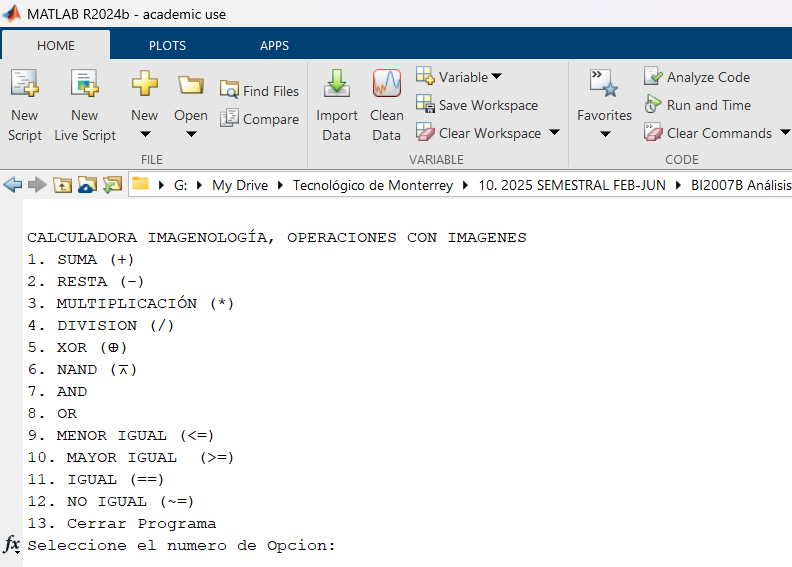  
   Ofrece 12 operaciones diferentes mediante una interfaz de terminal:

4. **Operaciones Disponibles**:
   | Operación | Símbolo | Ejemplo Resultado |
   |----------|---------|------------------|
   | Suma | `+` | 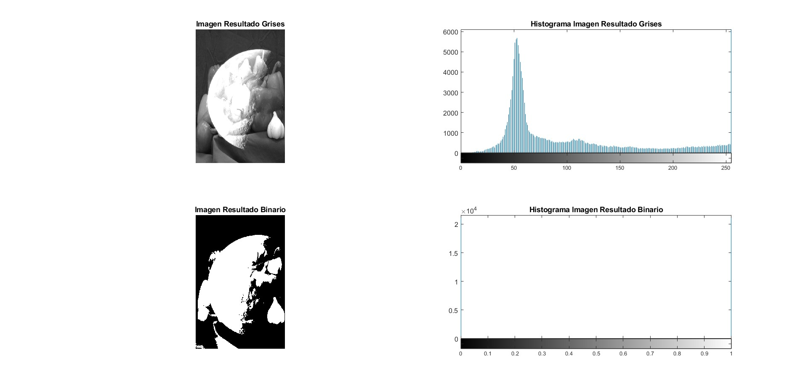 |
   | Resta | `-` | 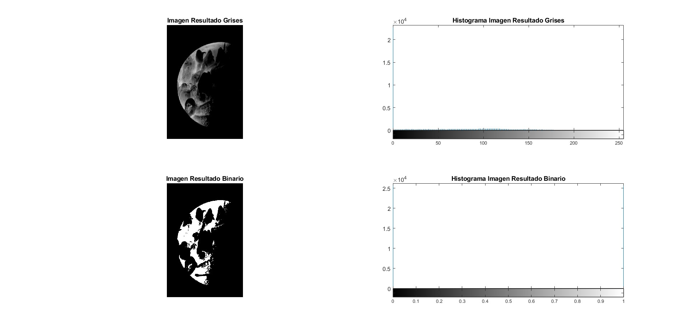 |
   | Multiplicación | `*` |  |
   | División | `/` | 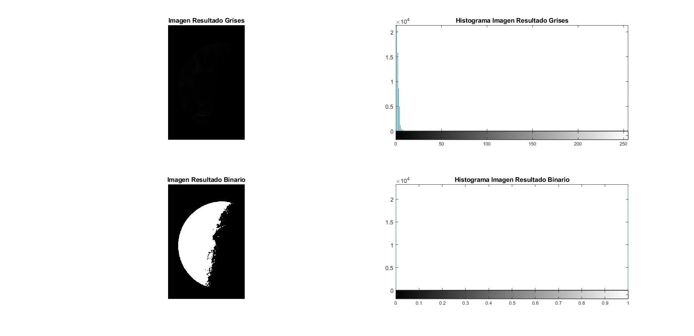 |
   | XOR | `⊕` | 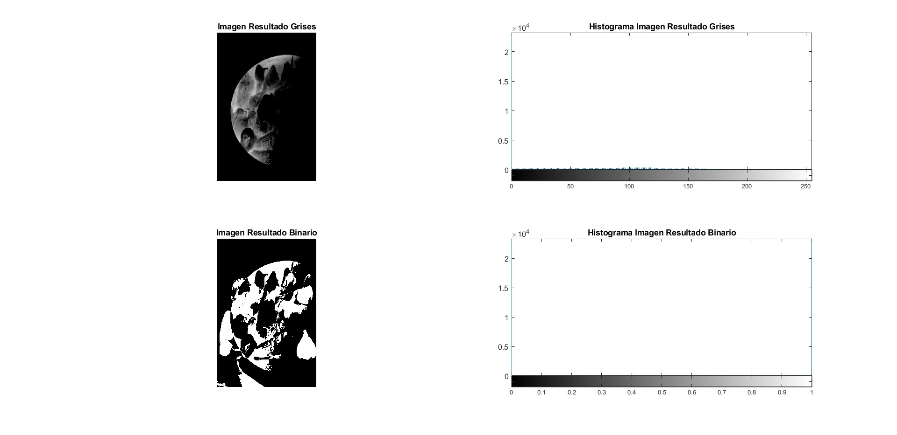 |
   | NAND | `⊼` | 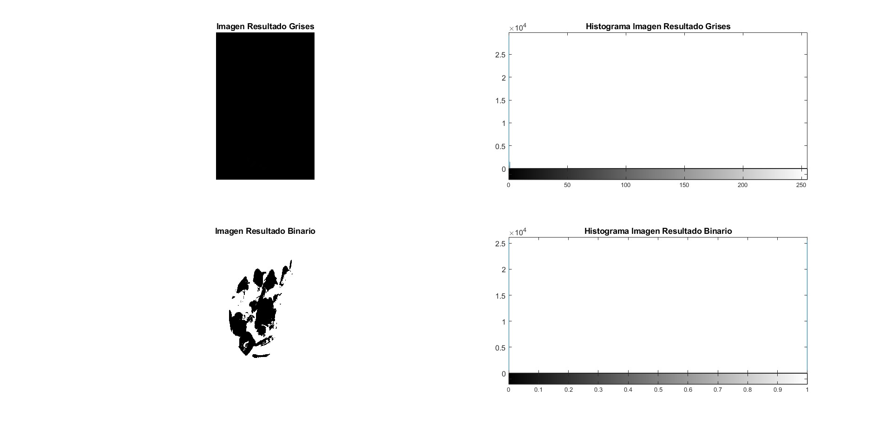 |
   | AND | - | 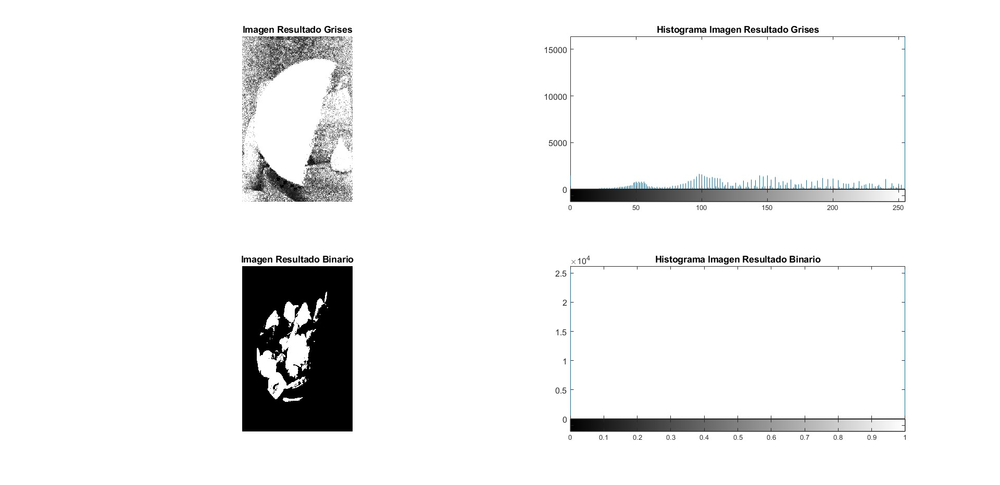 |
   | OR | - | 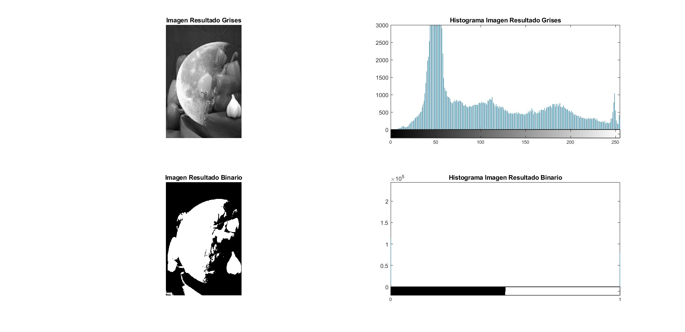 |
   | Menor o Igual | `<=` | 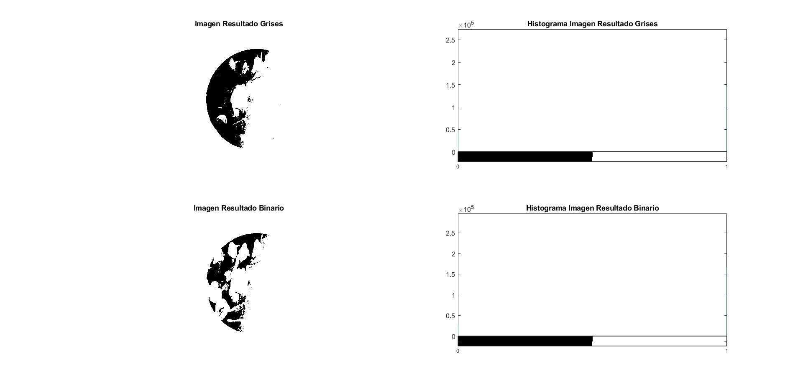 |
   | Mayor o Igual | `>=` | 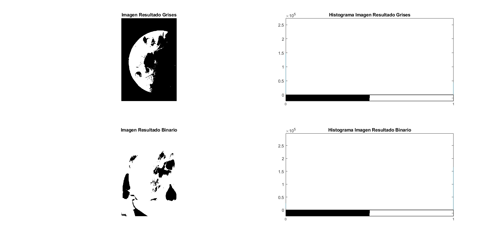 |
   | Igual | `==` | 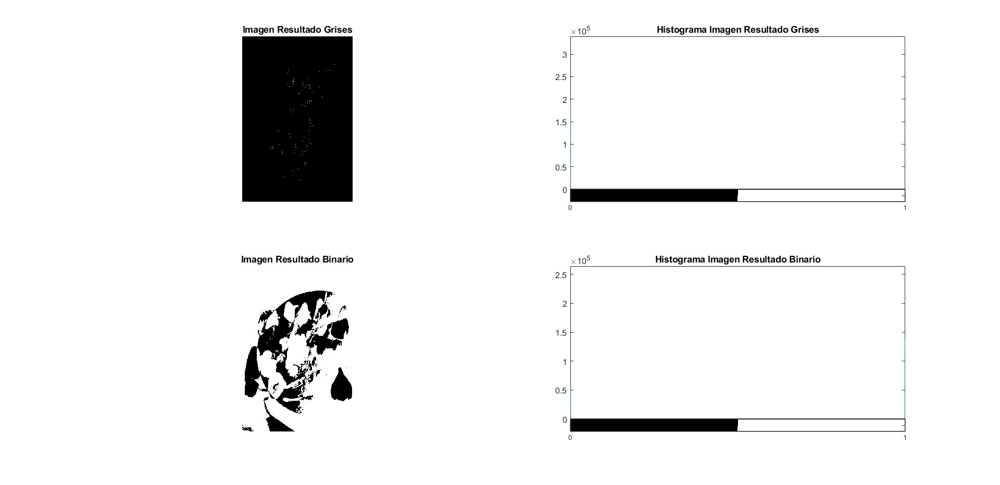 |
   | No Igual | `~=` | 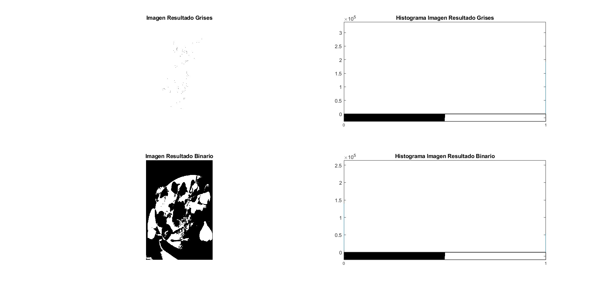 |

5. **Visualización de Resultados**:
   - Para cada operación muestra:
     - Imagen resultante en escala de grises
     - Su histograma correspondiente
     - Versión binarizada del resultado
     - Histograma de la versión binarizada

## 🎯 Propósito
Proyecto universitario desarrollado para la materia de **Procesamiento Digital de Imágenes** en el Tecnológico de Monterrey. Su finalidad es demostrar la aplicación práctica de operaciones fundamentales entre imágenes mediante técnicas de procesamiento digital.

## 🔍 Resultados Completos
Todos los resultados generados por las operaciones están disponibles en la carpeta [MATLAB/images/](MATLAB/images/):
- Comparativas iniciales: [FIG1.jpg](MATLAB/images/FIG1.jpg), [FIG2.jpg](MATLAB/images/FIG2.jpg)
- Resultados de cada operación (ver tabla anterior)

## 🚀 Aplicaciones Futuras
1. **Segmentación avanzada** de características en imágenes médicas
2. **Detección de cambios** en secuencias temporales (vigilancia)
3. **Fusión de imágenes** para aplicaciones astronómicas
4. **Procesamiento de video** en tiempo real
5. **Reconocimiento de patrones** combinado con redes neuronales
6. **Sistemas de visión artificial** para robótica

## 📜 Licencia
Copyright © 2025 Jesús Vásquez - Tecnológico de Monterrey

Este proyecto es material académico desarrollado como parte del programa educativo 
del Tecnológico de Monterrey. Se permite su uso para fines educativos y de investigación, siempre que se cite 
adecuadamente la fuente académica y se respeten los derechos de autor de las 
imágenes utilizadas en el proyecto.

---

**🔧 Requisitos**: MATLAB R2024b o superior  
**👨‍💻 Autor**: Jesús Vásquez
**🏫 Institución**: Tecnológico de Monterrey  
